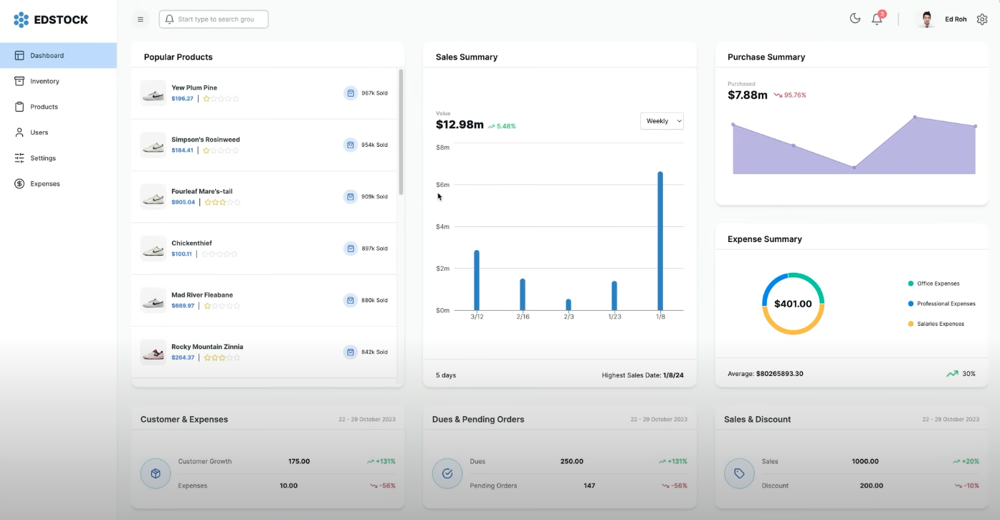
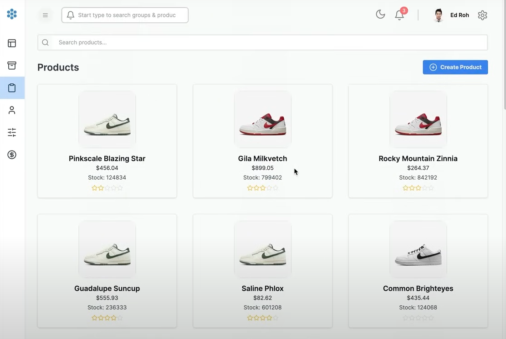
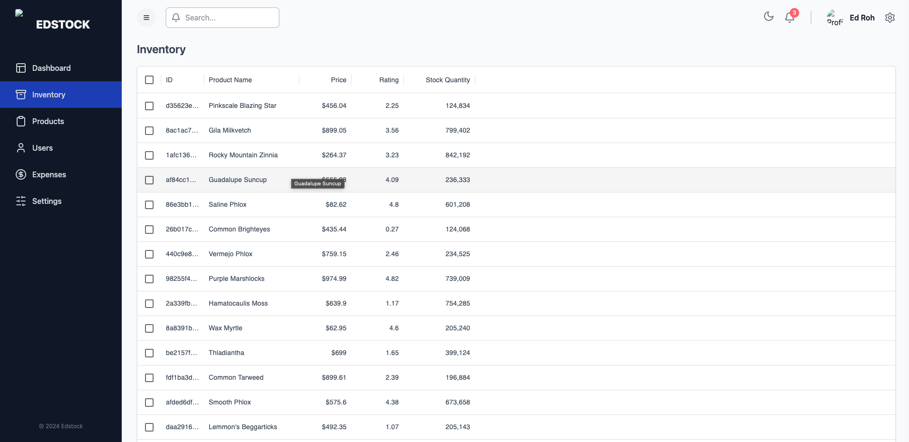
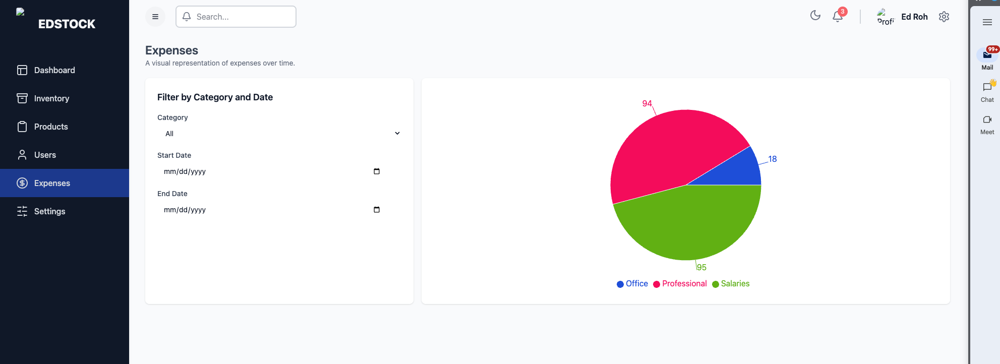
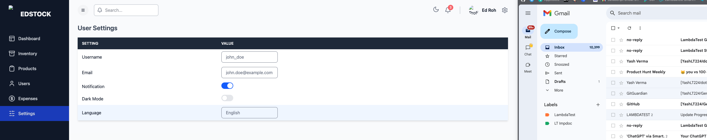
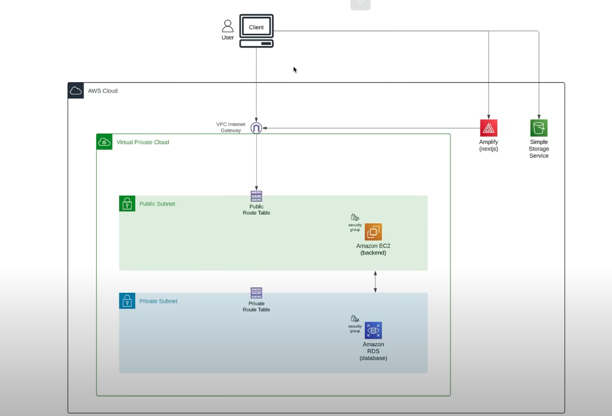

# Build a Fullstack Inventory Management Dashboard

Build and Deploy a Complete Full Stack Inventory Management Dashboard Application using Nextjs, Redux, Node, and AWS. This tutorial provides a step-by-step guide to building a full-stack inventory management dashboard using Next.js for the frontend, styled with Tailwind CSS and featuring Material UI Data Grid for complex data handling. State management is streamlined with Redux Toolkit, supplemented by Redux Toolkit Query for data fetching.

The backend is powered by Node.js, using Prisma as the ORM to facilitate database interactions. We delve deep into AWS, explaining basics for beginners, including setup, cost management, and networking fundamentals. Detailed walkthroughs are provided for deploying and integrating AWS services such as RDS for database management, EC2 for computing power, API Gateway for creating robust APIs, Amplify for frontend deployment, and S3 for storage solutions.

This comprehensive guide is designed for developers seeking to implement robust, scalable applications using AWS, offering clear insights into each service's role and setup within the project.

## Screenshots

## Video Tutorial

For a detailed walkthrough of this project, check out the tutorial on EdRoh's YouTube channel:
[Watch Tutorial](https://www.youtube.com/watch?v=ddKQ8sZo_v8)

